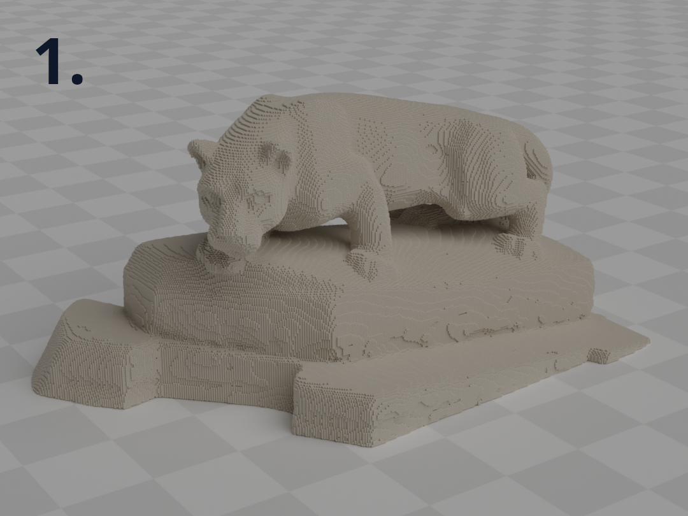
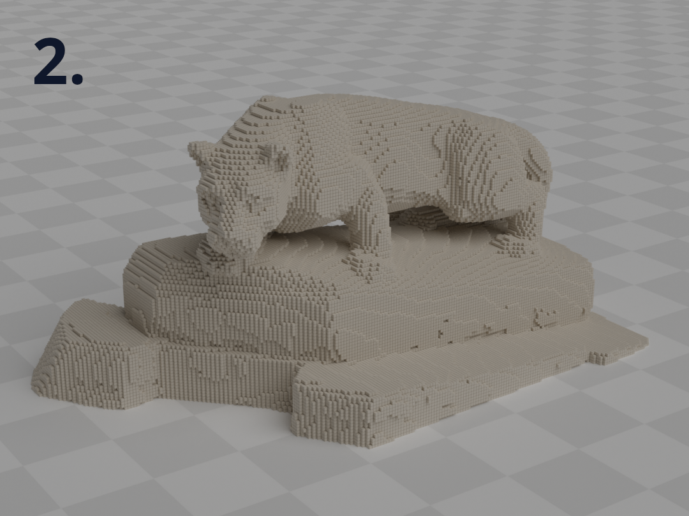
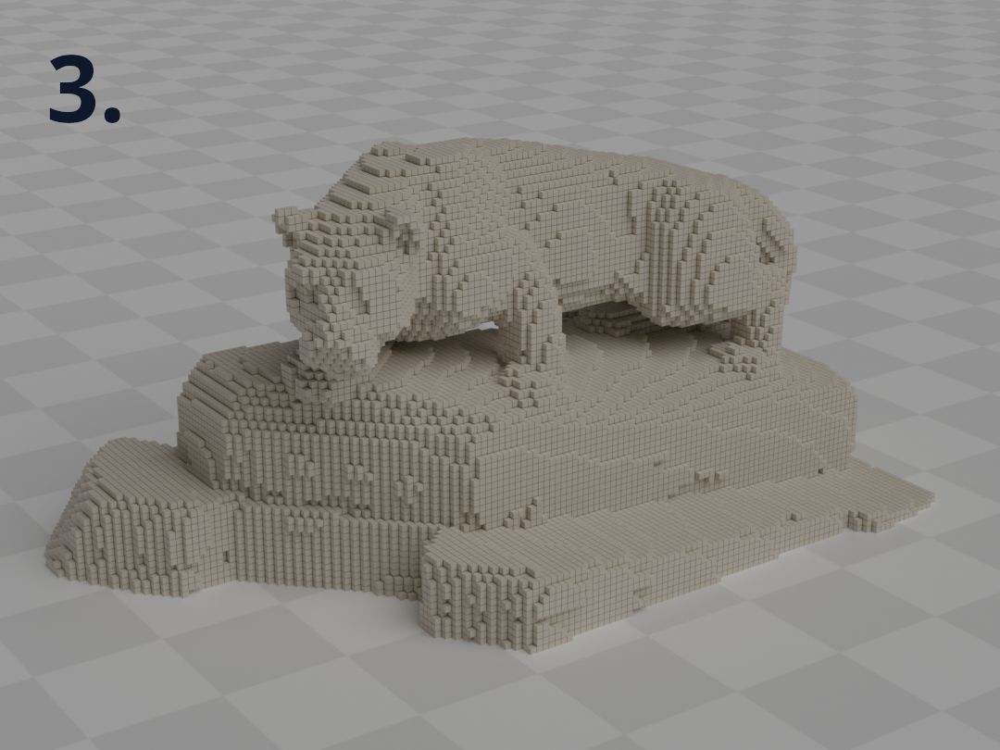
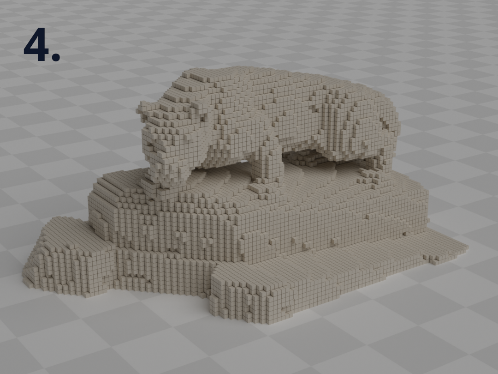

*A utility to convert voxel data stored in a 3D NumPy array into a collection of OBJ mesh cubes for visualizing, sharing, and rendering.*


## Overview
- Generates mesh vertices and faces corresponding to each point in a NumPy array. 
- The script is a utility to share voxel models with peers who can access a basic mesh modeling program that can open Wavefront OBJ files. 
- A helpful tool for generating voxel mesh models for images and renders. 
- The mesh OBJ files are relatively large due to the number of generated vertices and faces. 
- By default, the script filters out all internal voxels creating a surface view shell made only of voxels that border empty voxel regions.


## Usage
**Dependencies**
- NumPy is the only package dependency for the main python script.
- Additional dependencies listed in `requirements.txt` support the analysis completed in the jupyter notebook.

**Example Script Commands**

*Convert Numpy Voxel Data into OBJ Mesh*
```Bash
python obj-voxel-visualizer.py input-numpy-file.npy
```

*Specify Filename of OBJ Output*
```Bash
python obj-voxel-visualizer.py input-numpy-file.npy --output voxel-mesh-visual.obj
```

*Toggle Surface View Off*
```Bash
python obj-voxel-visualizer.py input-numpy-file.npy --no-surface-view
```

**Jupyter Notebook**
- Interactive examples
	- Converting NPY files using the command line function
	- Using internal functions to export loaded NPY data
	- Inline mesh viewer using Trimesh
- Measured runtime improvements over the original iteration of the function.
- Voxel data metrics evaluating voxel count and file size.
- Data plots illustrating the relationship between voxel count and the resulting OBJ file size when in surface view mode.


## Examples

<p align="center" style='font-weight: bold'>
  Voxel Model Cross-Section <br>
  Surface View ON vs Surface View OFF
</p>

<p align="center">
  
</p>

<p align="center" style='font-weight: bold'>
  Mesh Voxel Models with Varied Voxel Resolution
</p>
  
<p align="center">
  </img>
  </img>
  </img>
  </img>
</p>

|     | Surface Voxel Count | Voxel Array Bounding Box Dimensions | Voxel % of Bounding Box Magnitude |
|:---:| -------------------:| -----------------------------------:|:---------------------------------:|
|  1  |             340,106 |                   ( 408, 236, 176 ) |              0.1988%              |
|  2  |              83,142 |                    ( 204, 118, 88 ) |              0.3975%              |
|  3  |              36,269 |                     ( 136, 79, 59 ) |              0.5953%              |
|  4  |              19,786 |                     ( 102, 59, 44 ) |              0.7950%              |

<br>


## Calculating Voxel Resolution
- Voxel resolution is measured as a percentage of the voxel grid dimension magnitude.
- Assuming there is no padding around the model's minimum bounding box, the resolution indicates the voxel size and the model orientation within the voxel grid.
- A larger voxel size will decrease the detail on the model surface and reduce the size of the file containing the voxel data.
- Decreasing the voxel resolution percentage increases the number of voxels inside the voxel grid array.

$$
\left(\ x\, \ y\, \ z \ \right) = \text{ndarray.shape}
$$

$$
\text{Voxel ％ of Bounding Box Magnitude} = \left( \frac{1 \text{ voxel}}{ \sqrt{x^2+y^2+z^2} } \right) * 100
$$