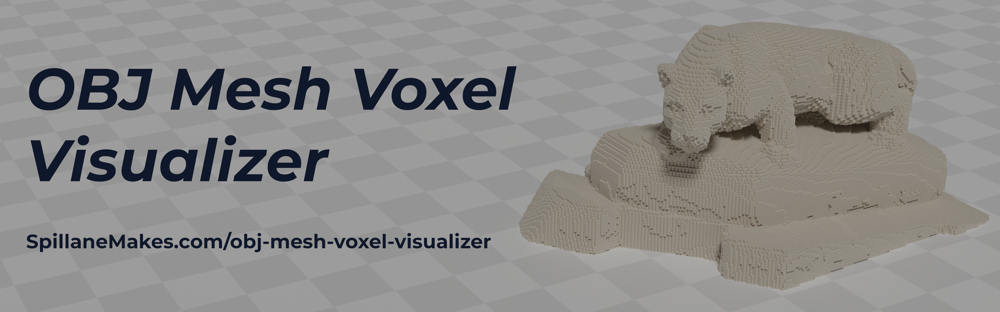
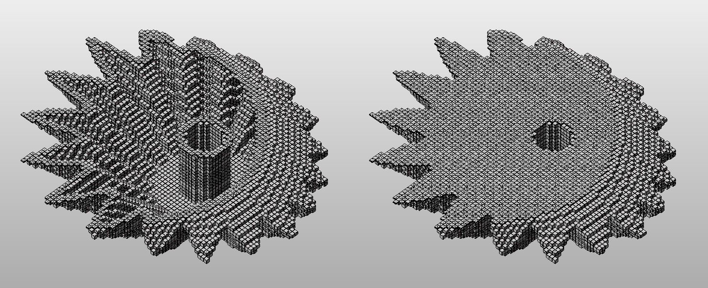
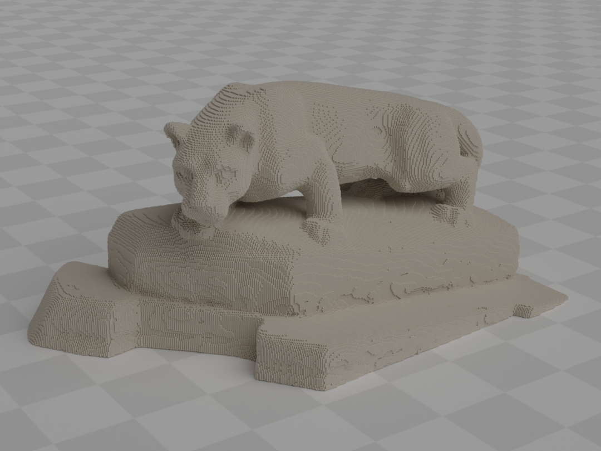
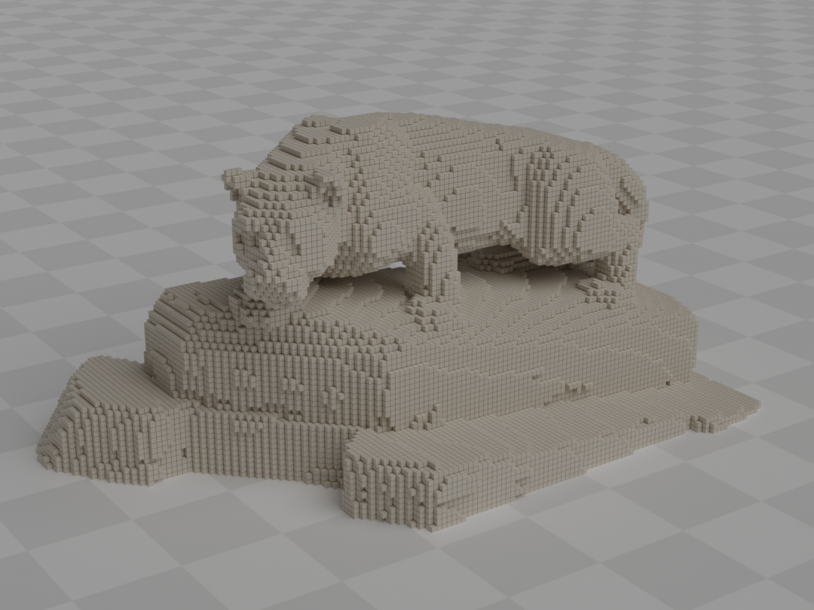
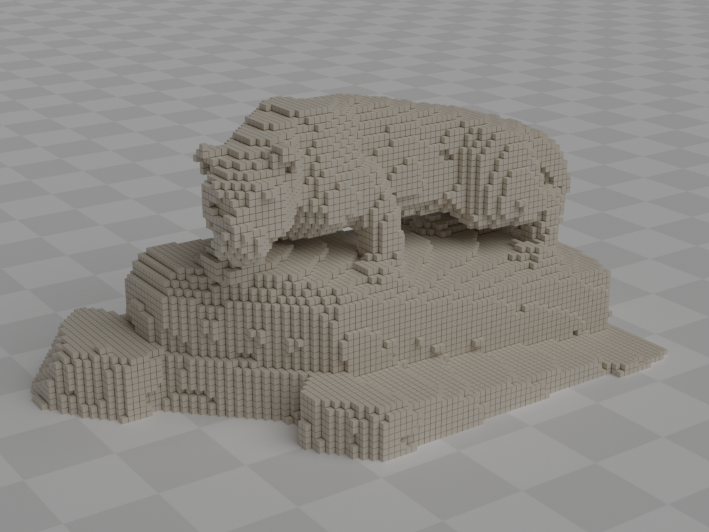

*A utility to convert voxel data stored in a 3D NumPy array into a collection of OBJ mesh cubes for visualizing, sharing, and rendering.*


## Overview
- Generates mesh vertices and faces corresponding to each point in a NumPy array. 
- The script is a utility to share voxel models with peers who can access a basic mesh modeling program that can open Wavefront OBJ files. 
- A helpful tool for generating voxel mesh models for images and renders. 
- The mesh OBJ files are relatively large due to the number of generated vertices and faces. 
- By default, the script filters out all internal voxels creating a surface view shell made only of voxels that border empty voxel regions.


## Usage
**Dependencies**
- NumPy is the only package dependency for the main python script.
- Additional dependencies listed in `requirements.txt` support the analysis done in the jupyter notebook.

**Example Script Commands**

*Convert Numpy Voxel Data into OBJ Mesh*
```Bash
python obj-voxel-visualizer.py input-numpy-file.npy
```

*Specify Filename of OBJ Output*
```Bash
python obj-voxel-visualizer.py input-numpy-file.npy --output voxel-mesh-visual.obj
```

*Toggle Surface View Off*
```Bash
python obj-voxel-visualizer.py input-numpy-file.npy --no-surface-view
```

**Jupyter Notebook**
- Interactive examples
	- Converting NPY files using the command line function
	- Using internal functions to export loaded NPY data
	- Inline mesh viewer using Trimesh
- Measured runtime improvements over the original iteration of the function.
- Voxel data metrics evaluating voxel count and file size.
- Data plots illustrating the relationship between voxel count and the resulting OBJ file size when in surface view mode.


## Examples

<p align="center">Surface View ON vs Surface View OFF</p>

<p align="center">
  
</p>

<p align="center">Different Resolution Voxel Mesh Models</p>
  
<p align="center">
  
  
  
  
</p>
